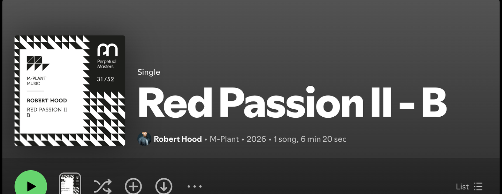
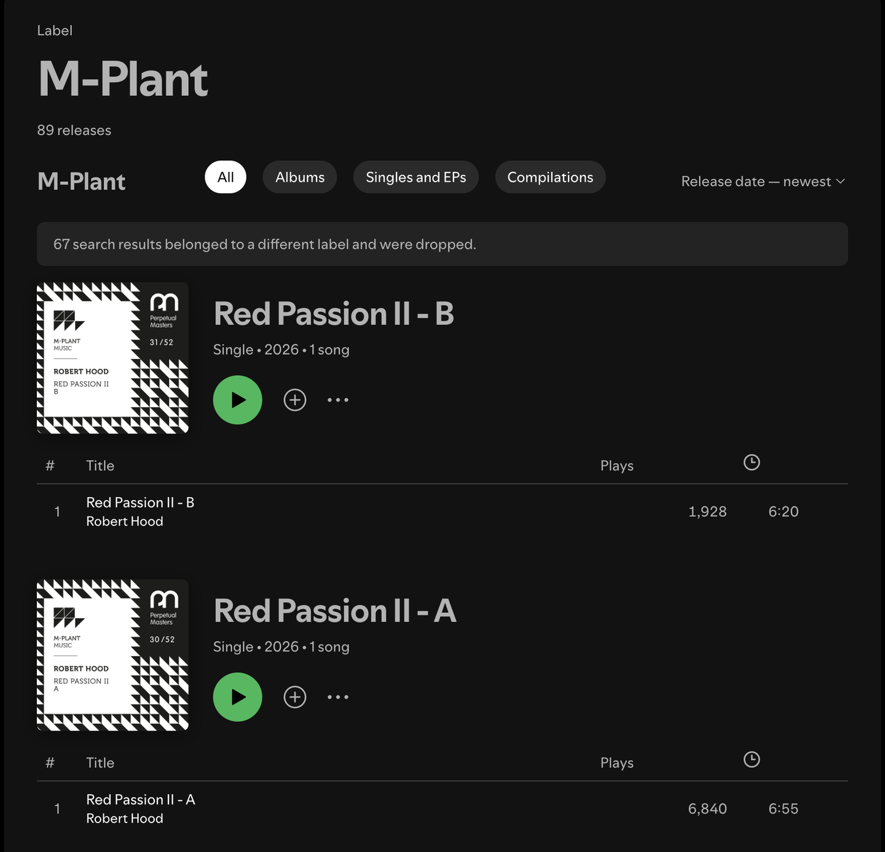
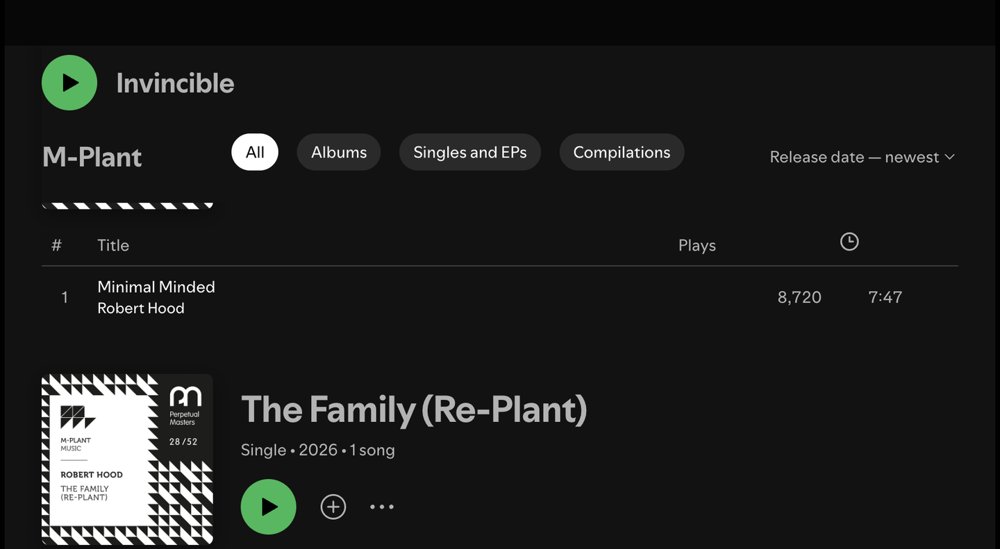

# Label Catalogue for Spotify

**Record labels as first-class pages in the Spotify desktop client.** Click the label on any release and browse everything that label has put out — laid out like an artist discography, with cover art, full tracklists, play counts, filters and playback.

Built on [Spicetify](https://spicetify.app). No separate app, no re-implemented player, no extra login: it runs inside the client you already use.



The label sits in the release header between the artist credits and the year, styled like any other metadata link. One click opens the catalogue:



## Why

Spotify prints the label on every release — as dead text in the fine print. There is no label page, no way to answer "what else is on this label?", even though for electronic music, jazz and classical the label *is* the recommendation engine. This project adds the missing page.

## Features

- **Native look and feel** — built from Spotify's own runtime components (cards, chips, context menus), so the page reads as part of the client, not a plugin
- **Complete catalogues** — a three-pass collection strategy verifies every release and reaches past the search API's hard 100-result ceiling (for [M-Plant](https://www.m-plant.com/) that is the difference between 30 releases and 89)
- **No impostors** — every candidate is checked against its real label value; look-alikes like "M-Plant Music" or "Kompakt Extra" are dropped, and the page tells you how many
- **Expanded discography view** — one release per row with its full tracklist, real play counts, durations, hover-to-play, artist links and add-to-library
- **Sticky header** — the current release and a play button stay pinned while you scroll, exactly like the artist page
- **Filters and sorting** — Albums / Singles and EPs / Compilations, by release date or name
- **Fast on revisit** — album details are cached locally; a second visit renders instantly
- **Self-healing across Spotify updates** — the internal search API is addressed by a build-specific persisted-query hash; the extension captures the current one from the client's own traffic, so an update doesn't require a new release



## Install

### From Spicetify Marketplace

Open **Marketplace → Extensions**, search for *Label Catalogue*, install. That is
the whole thing — it ships as a single self-contained extension.

### Manually

Requirements: [Spotify for desktop](https://www.spotify.com/download/) (not the App Store build), [Spicetify](https://spicetify.app/docs/getting-started) ≥ 2.44.

```bash
curl -o ~/.config/spicetify/Extensions/label-catalog.js \
  https://raw.githubusercontent.com/chstnkh/spicetify-label-catalog/main/projects/label-link/dist/label-catalog.js

spicetify config extensions label-catalog.js
spicetify apply
```

Open any album — the label in the header is now a link.

<details>
<summary>Optional: install as a custom app instead</summary>

The extension renders the catalogue by mounting into the main view on
`/label-catalog`. Spicetify has no runtime API for registering routes, so this is
how an extension can own a real URL with working back/forward navigation.

If you would rather have the route registered natively, the repository also
builds a custom app. Install both — the extension detects the custom app and
stands down, leaving the route to it:

```bash
git clone https://github.com/chstnkh/spicetify-label-catalog.git
cd spicetify-label-catalog && npm install && npm run build

ln -s "$(pwd)/projects/label-catalog/dist" ~/.config/spicetify/CustomApps/label-catalog
ln -s "$(pwd)/projects/label-link/dist/label-catalog.js" ~/.config/spicetify/Extensions/label-catalog.js

spicetify config custom_apps label-catalog
spicetify config extensions label-catalog.js
spicetify apply
```

</details>

## How it works

This is the interesting part: **the record label is not an entity in any Spotify API.** There is no label ID, no endpoint, no way to enumerate a roster — only a free-text `label` string on full album objects. On top of that, the public Web API rate-limits aggressively and caps `label:` searches at around 100 results.

So the catalogue is assembled in three passes against the client's own internal search backend instead:

1. **Search** — `label:"…"`, collecting candidates only as far as the backend's own reported total. The internal `searchAlbums` operation is relevance-*ranked*, not filtered: past the genuine matches it keeps serving progressively looser look-alikes rather than stopping. Paging blindly is how unrelated records end up in a label catalogue.
2. **Verify** — fetch each candidate's real `label` value and keep exact matches (compared punctuation- and case-insensitively, so "M-Plant" and "M Plant" are one label while "M-Plant Music" stays separate). The same request already carries the tracklist and play counts the UI needs, so verification is free.
3. **Expand** — the search ceiling is a hard 100, so walk the full discography of every artist found on the label and check those releases too. This is what finds the majority of a large catalogue.

The page renders incrementally while all of this happens, and reports honestly: how many search results were rejected, and whether anything was truncated.

## Caveats

- Verified on Spotify **1.2.94.583** with Spicetify **2.44.0** (macOS). Spotify updates occasionally break Spicetify in general — if the link or page disappears after an update, wait for a Spicetify release and re-apply.
- Play counts come from the client's internal API (the same numbers the album page shows). They are not available from the public Web API.
- The `label:` search filter is undocumented and could change on Spotify's side.
- Roster expansion is capped at 40 artists per label as a request-volume guard; enormous rosters may still be incomplete.

## Development

Unit tests (`npm test`), live checks driven over the Chrome DevTools Protocol, a
sandboxed dev workflow that never touches your daily Spotify install, and the
collected list of traps (undocumented components, persisted-query hashes, macOS
single-instance behaviour) are documented in [DEVELOPMENT.md](DEVELOPMENT.md).

## License

[MIT](LICENSE)
